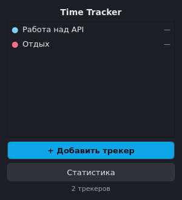
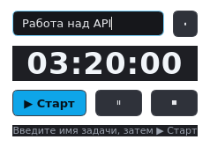

# Time Tracker

Минималистичный трекер времени на **PySide6**. Каждое окошко — независимый таймер, который можно добавлять, двигать и закрывать по отдельности. Считает время без условностей: без лимитов, правил и пауз по расписанию.

## Возможности

- **Независимые окна-таймеры** — каждое поверх других, со своим именем, таймером и кнопками ▶ Старт / ⏸ Пауза / ⏹ Стоп.
- **Счёт без дрейфа** — время накапливается через `time.monotonic()`, а не по количеству тиков UI.
- **Персистентность** — трекеры, их позиции и сессии сохраняются в SQLite и восстанавливаются при перезапуске.
- **Статистика** — время за день, графики по дням и по трекерам (QtCharts), список всех сессий. Обновляется автоматически.
- **Тёмная минималистичная тема**.
- **Остановка при закрытии** — закрыл окно → таймер останавливается и сессия фиксируется; при выходе из приложения идущие сессии тоже сохраняются.

## Установка

Требуется Python 3.9+.

```bash
python3 -m venv .venv
source .venv/bin/activate
pip install -r requirements.txt
```

## Запуск

```bash
python main.py
```

Данные хранятся в `~/.local/share/time-tracker/data.db`.

## Скриншоты

| Панель управления | Окно трекера |
|---|---|
|  |  |

## Как пользоваться

1. Нажмите **«+ Добавить трекер»** — появится отдельное окошко.
2. Впишите название задачи (например, «Работа над API»).
3. Нажмите **▶ Старт** — начнётся отсчёт.
4. ⏸ — пауза, ⏹ — остановить и сохранить сессию, ✕ — закрыть окно (сессия тоже сохранится).
5. **«Статистика»** — графики и таблица сессий.

## Структура проекта

```
time-tracker/
├── main.py                 # точка входа
├── requirements.txt
├── tracker_app/
│   ├── app.py              # тёмная тема (QSS)
│   ├── models.py           # Tracker, Session
│   ├── storage.py          # SQLite-хранилище и статистика
│   ├── timer.py            # TimerEngine (точный счёт, без дрейфа)
│   ├── main_window.py      # панель управления
│   ├── tracker_window.py   # независимое окно-таймер
│   └── stats_window.py     # статистика с графиками
└── tests/
    ├── test_timer.py       # логика таймера
    ├── test_storage.py     # CRUD и статистика SQLite
    └── test_gui_smoke.py   # smoke-тесты интерфейса (offscreen)
```

## Тесты

```bash
QT_QPA_PLATFORM=offscreen python -m pytest tests/
```

## База данных

```sql
trackers(id, name, color, pos_x, pos_y, created_at)
sessions(id, tracker_id REFERENCES trackers ON DELETE CASCADE,
         started_at, ended_at, duration_seconds)
```
